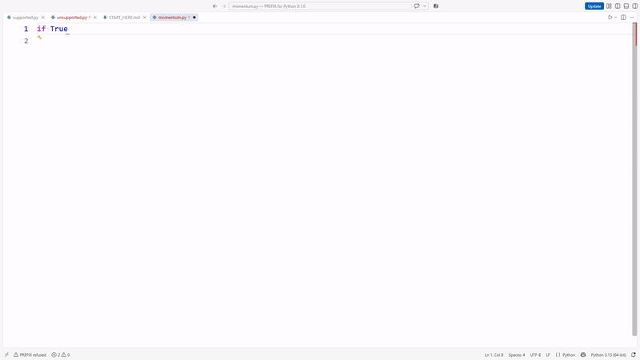

# PREFIX for Python

**Local, deterministic correction for a bounded set of Python 3.12 structural mistakes.**

PREFIX applies a mapped structural correction when the engine can prove one safe continuation. It refuses ambiguous, semantic and unsupported states. The existing qualified correction adapter and its response validation are preserved.

**Publication review candidate.** Live activation and fulfillment for this commercial integration remain unverified. The existing Lemon Squeezy offer describes the qualified keyless 77d742f customer bundle; this candidate must not replace that delivery without final qualification and release authority.

## One product, one purchase

The extension interface is free to install. The PREFIX engine is one **$29 USD, one-time** product. The CLI and supported editor adapters use that same engine and commercial entitlement; there is no separate VS Code purchase.

[Buy PREFIX for Python — $29 once](https://fastlaunch.lemonsqueezy.com/checkout/buy/37f6bf48-4f0d-4151-a076-8b60f030e985) · [Product page](https://fast-industries-prefix.steven-k-ratushniak.chatgpt.site/prefix/)

## Supported setup

- Windows x64 or Linux amd64.
- CPython >=3.12,<3.13.
- Desktop VS Code >=1.85 with the locally installed PREFIX engine.
- Browser-only VS Code, macOS, ARM64 and other Python minor versions are outside the 0.1.0 support claim.
- Open VSX client compatibility requires testing the exact client; registry compatibility is not a qualification claim for every editor.

Install the PREFIX engine package for your operating system, then install this extension. PREFIX discovers its installed runtime automatically. If you deliberately use an alternate supported engine installation, set `prefixPython.pythonCommand` to that CPython 3.12 executable.

## Use PREFIX

Open a Python document and run:

- `PREFIX: Govern Active Python Transition` for the active document.
- `PREFIX: Govern Selected Python Structure` for one explicit selection.
- `PREFIX: Show Last Transition Governance Surface` to inspect the latest outcome.

The existing Enter integration evaluates only its mapped, bounded line-local correction surface. Enable or disable it with `prefixPython.enableOnEnter`.

Mapped corrections include missing block colons, mapped block indentation and empty bodies, mapped unmatched delimiters, a mapped single extra closing delimiter, and safe indentation-tab normalization. PREFIX preserves literal data and refuses corrections outside that boundary. It is not a general semantic debugger or code generator. Review applied changes.

## Activation in this candidate

Run `PREFIX: Activate License` and paste the purchased PREFIX key into the masked input box. The extension passes the key to the shared engine through standard input. It does not place the key in a process command line.

Run `PREFIX: License Status` to check this installation, `PREFIX: Deactivate This Installation` to release it, or `PREFIX: Buy PREFIX — $29 Once` to open the established checkout.

Activation needs network access. Correction runs locally using the existing cached-entitlement policy. Failed, absent, corrupt or expired entitlement refuses commercial correction without altering your Python source. Live issuance of compatible keys for this candidate is a publication blocker, so do not assume the currently published keyless bundle requires this activation step.

## Demonstration

[Watch the existing Sarah-narrated PREFIX commercial](https://github.com/stevenkratushniak-ctrl/FastIndustries-Public-Media/releases/download/prefix-77d742f-sarah-commercial-20261004/PREFIX_010_77d742f_LEMON_SQUEEZY_DEMO.mp4).

This excerpt shows the existing qualified Enter correction recording. It does not claim a correction latency or demonstrate live commercial activation.

The prepared screenshot assets reproduce real qualified Enter and manual-correction recordings. Their owner approval and public-hosting checks remain publication tasks.

## Privacy and support

Correction source stays in the local engine. License activation and validation use Lemon Squeezy's licensing API. Local receipts can retain source before and after corrections. Read [PRIVACY.md](PRIVACY.md) and the [published privacy policy](https://fast-industries-prefix.steven-k-ratushniak.chatgpt.site/legal/prefix/privacy/).

Use the [technical issue tracker](https://github.com/stevenkratushniak-ctrl/PREFIX-for-Python/issues) for reproducible problems. For orders and private license questions, reply to the Lemon Squeezy purchase receipt. Keep license keys and private source out of public issues.

[License](https://fast-industries-prefix.steven-k-ratushniak.chatgpt.site/legal/prefix/license/) · [Terms](https://fast-industries-prefix.steven-k-ratushniak.chatgpt.site/legal/prefix/terms/) · [Refunds](https://fast-industries-prefix.steven-k-ratushniak.chatgpt.site/legal/prefix/refund/) · [Support](SUPPORT.md)
